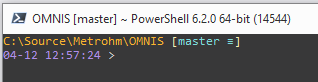

Paste code to profile:

```
Import-Module posh-git

$GitPromptSettings.DefaultPromptPath.ForegroundColor = 'Orange'
$GitPromptSettings.DefaultPromptBeforeSuffix.Text = '`n$([DateTime]::now.ToString("MM-dd HH:mm:ss")) '
$GitPromptSettings.DefaultPromptBeforeSuffix.ForegroundColor = 0xa076e8
$GitPromptSettings.EnableStashStatus = $true
```

- to open profile you can use command: `notepad.exe $profile` 
- to reload profile you can use command: `. $profile`

<br />

preview: <br />




### Some customization commands

```powershell
# General GIT command aliases
Function Git-Fetch { git fetch }
Set-Alias fetch Git-Fetch

Function Git-Pull { git pull }
Set-Alias pull Git-Pull

Function Git-Push { git push }
Set-Alias push Git-Push

Function Git-Add { git add . }
Set-Alias add Git-Add

Function Git-Reset { git reset --hard }
Set-Alias reset Git-Reset

Function Git-Commit($message) { git commit -m $message }
Set-Alias commit Git-Commit

Function Git-Checkout($branchName){ git checkout $branchName }

```
